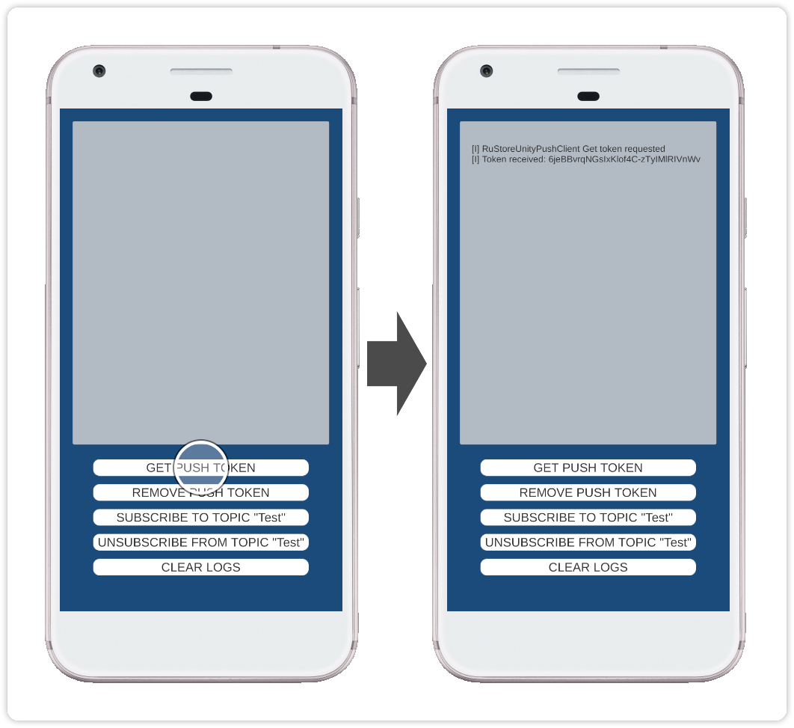

> ⚠️ Не используйте кнопку "Код → Скачать" на сайте GitFlic – этот метод не загружает файлы из Git LFS. [Инструкция по клонированию](../README_CLONE.md).

### Unity-плагин RuStore для подключения пуш-уведомлений

#### [🔗 Документация разработчика][10]

#### Условия работы SDK

Для работы push-уведомлений необходимо соблюдение следующих условий.

- На устройстве пользователя должно быть установлено приложение RuStore.
- Приложение RuStore должно поддерживать функциональность push-уведомлений.
- Приложению RuStore разрешен доступ к работе в фоновом режиме.
- Пользователь должен быть авторизован в приложении RuStore.
- Отпечаток подписи приложения должен совпадать с отпечатком, добавленным в Консоль RuStore.

#### Подготовка требуемых параметров

Перед настройкой примера приложения необходимо подготовить следующие данные.

- `applicationId` — уникальный идентификатор приложения в системе Android в формате обратного доменного имени (например: ru.rustore.sdk.example).
- `*.keystore` — файл ключа, который используется для [подписи и аутентификации Android приложения](https://www.rustore.ru/help/developers/publishing-and-verifying-apps/app-publication/apk-signature/).
- `projectId` — ID push-проекта из консоли разработчика RuStore. Необходим для формирования push token и [отправки push-уведомлений](https://www.rustore.ru/help/sdk/push-notifications/send-push-notifications) (например: https://console.rustore.ru/apps/_“your_account_id”_/push/projects/-Yv4b5cM2yfXm0bZyY6Rk7AHX8SrHmLI, `projectId` = -Yv4b5cM2yfXm0bZyY6Rk7AHX8SrHmLI).

#### Настройка примера приложения

1. Откройте проект **Unity** из папки `push_example`.
1. Откройте настройки **RuStore Push SDK** (**Window → RuStoreSDK → Settings → PushClient**).
1. В поле **VKPNS Project Id** укажите значение `projectId` — ID push-проекта из консоли разработчика RuStore.
1. В файле **AndroidManifest.xml** (**Assets/Plugins/Android/**) замените строку **YOUR_PROJECT_ID** на значение `projectId`.
1. В разделе **Publishing Settings** (**Edit → Project Settings → Player → Android Settings**) выберите вариант **Custom Keystore** и задайте параметры **Path / Password**, **Alias / Password** подготовленного файла `*.keystore`.
1. В разделе **Other Settings** (**Edit → Project Settings → Player → Android Settings**) настройте раздел **Identification**, отметив опцию **Override Default Package Name** и указав `applicationId` в поле **Package Name**.
1. Выполните сборку проекта командой **Build** (**File → Build Settings**) и проверьте работу приложения.

#### Сценарий использования

##### Получение push-токена пользователя

Тап по кнопке `Get push token` выполняет процедуру [получения текущего push-токена пользователя][20]. Push-токен пользователя, полученный в приложении, используется в структуре `message` для [отправки push-уведомлений](https://www.rustore.ru/help/sdk/push-notifications/send-push-notifications).

#### История изменений

[CHANGELOG](../CHANGELOG.md)

#### Условия распространения

Данное программное обеспечение, включая исходные коды, бинарные библиотеки и другие файлы, распространяется под лицензией MIT. Информация о лицензировании доступна в документе [MIT-LICENSE](../MIT-LICENSE.txt).

#### Техническая поддержка

Дополнительная помощь и инструкции доступны в [документациии RuStore](https://www.rustore.ru/help/) и по электронной почте support@rustore.ru.

[10]: https://www.rustore.ru/help/sdk/push-notifications/unity/7-0-0
[20]: https://www.rustore.ru/help/sdk/push-notifications/unity/7-0-0/#get-push-token
